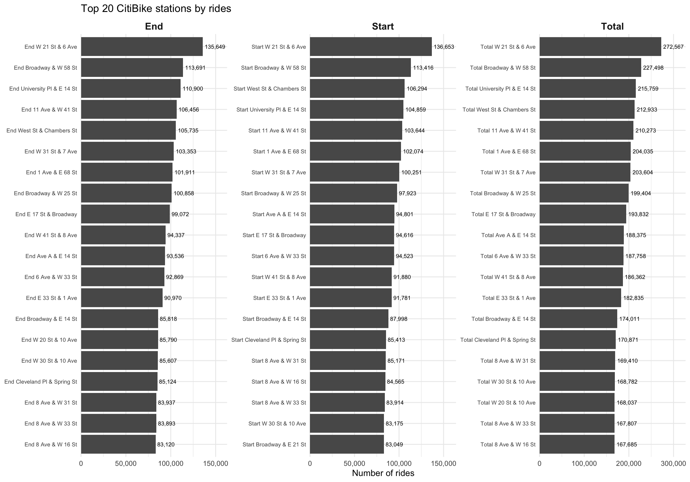

<script>
document.addEventListener("DOMContentLoaded", function() {

  // Wait until tocify has built the TOC
  let checkTOC = setInterval(function() {

    // Ensures headers exist
    if (document.querySelectorAll(".tocify-header").length > 0) {
      clearInterval(checkTOC);

      // Step 1: hide all H2 sections
      document.querySelectorAll(".tocify-subheader").forEach(function(ul){
        ul.style.display = "none";
      });

      // Step 2: Add click behavior to all H1 list items
      document.querySelectorAll(".tocify-item").forEach(function(header) {
        
        // clickable
        header.style.cursor = "pointer";

        header.addEventListener("click", function() {
          // find the ul.tocify-subheader immediately following this header
          let sub = header.nextElementSibling;

          if (sub && sub.classList.contains("tocify-subheader")) {
            // toggle show/hide
            if (sub.style.display === "none") {
              sub.style.display = "block";
            } else {
              sub.style.display = "none";
            }
          }
        });
      });

    }
  }, 200);
});
</script>


<div class="subpage-body">

# Spatial Patterns Overview
<div class="section-divider"></div>

This page examines spatial patterns in CitiBike usage across New York City.  
We explore ride intensity at start and end stations, identify the most active hubs,  
and visualize geographic clustering using maps and aggregated summaries.

---

# Data Import and Assembly
<div class="section-divider"></div>

We begin by loading required packages and setting global plotting options.

```{r setup, eval=FALSE}
library(tidyverse)

knitr::opts_chunk$set(
  fig.width = 6,
  fig.asp = .6,
  out.width = "90%"
)

theme_set(theme_minimal() + theme(legend.position = "bottom"))

options(
  ggplot2.continuous.colour = "viridis",
  ggplot2.continuous.fill = "viridis"
)

scale_colour_discrete = scale_colour_viridis_d
scale_fill_discrete = scale_fill_viridis_d
```

---

## Loading the 2023 CitiBike Trip Dataset
<div class="section-divider"></div>

All 2023 monthly trip files are read from the directory and combined into a single dataframe.

```{r, eval=FALSE}
library(vroom)

citibike_df =
  "2023-citibike-tripdata" |>
  list.files(pattern = "\\.csv$", full.names = TRUE, recursive = TRUE) |>
  sort() |>
  vroom() |> 
  drop_na()
```

The resulting dataset contains millions of observations and includes station coordinates, trip times,  
bike type, membership status, and start/end station identifiers.

---

## Counting Rides at Start and End Stations
<div class="section-divider"></div>

We aggregate station usage by computing:

- Number of rides **starting** at each station  
- Number of rides **ending** at each station  
- Total ridership per station (start + end)

```{r, eval=FALSE}
# count rides per START station
start_counts =
  citibike_df |>
  filter(!is.na(start_lat), !is.na(start_lng)) |>
  rename(station_name = start_station_name) |> 
  group_by(station_name, start_lat, start_lng) |>
  summarize(n_rides = n(), .groups = "drop")

# count rides per END station
end_counts =
  citibike_df |>
  filter(!is.na(end_lat), !is.na(end_lng)) |>
  rename(station_name = end_station_name) |> 
  group_by(station_name, end_lat, end_lng) |>
  summarize(n_rides = n(), .groups = "drop")

# Total count rides per station
total_counts =
  bind_rows(
    start_counts |> select(station_name, n_rides),
    end_counts   |> select(station_name, n_rides)
  ) |>
  group_by(station_name) |>
  summarize(n_rides = sum(n_rides), .groups = "drop")
```

---

# Top 20 CitiBike Stations
<div class="section-divider"></div>

A helper function generates bar plots of the top 20 busiest stations based on ride counts.

```{r, eval=FALSE}
make_top20_plot = function(df, title) {
  df |>
    slice_max(n_rides, n = 20) |>
    ggplot(aes(x =n_rides, y =  reorder(station_name, n_rides))) +
    geom_col() +
    geom_text(
      aes(label = scales::comma(n_rides)),
      hjust = -0.1,
      size = 2
    ) + 
    labs(
      title = title,
      x = "Number of rides",
      y = NULL
    ) + 
    scale_x_continuous(
      labels = scales::comma,
      n.breaks = 10
    ) +
    coord_cartesian(clip = "off") +
    theme(axis.text.y = element_text(size = 7)
          ) 
}
```

This function will be reused for start, end, and total ridership rankings.

---

## Constructing the Top-20 Dataset
<div class="section-divider"></div>

We create a dataframe containing the top 20 busiest stations for:

- Start rides  
- End rides  
- Total rides  

```{r, eval=FALSE}
top20_all_stations =
  bind_rows(
    start_counts |> 
      slice_max(n_rides, n = 20) |> 
      mutate(type = "Start"),
    
    end_counts |> 
      slice_max(n_rides, n = 20) |> 
      mutate(type = "End"),
    
    total_counts |> 
      slice_max(n_rides, n = 20) |> 
      mutate(type = "Total")
  ) |> 
  group_by(type) |>
  arrange(n_rides) |>
  mutate(
    station_ordered = factor(paste(type, station_name),                    
             levels = paste(type, station_name)            
    )
  ) |>
  ungroup()
```

---

## Visualization: Top 20 CitiBike Stations
<div class="section-divider"></div>

We compare start, end, and total ride counts using faceted bar charts.

```{r, eval=FALSE}
p_top20 =
  ggplot(
    top20_all_stations,
    aes(
      x = n_rides,
      y = station_ordered,
      text = paste0(
        "Station: ", station_name, "<br>",
        "Rides: ", scales::comma(n_rides), "<br>",
        "Type: ", type
      )
    )
  ) +
  geom_col() +
  geom_text(
    aes(label = scales::comma(n_rides)),
    hjust = -0.1,
    size = 2.5
  ) +
  facet_wrap(~ type, scales = "free") +
  scale_x_continuous(
    labels = scales::comma,
    n.breaks = 4,
    expand = expansion(mult = c(0, 0.2))
  ) +
  coord_cartesian(clip = "off") + 
  labs(
    title = "Top 20 CitiBike stations by rides",
    x = "Number of rides",
    y = NULL
  ) +
  theme_minimal() +
  theme(
    axis.text.y = element_text(size = 7),
    strip.text = element_text(size = 12, face = "bold"),
  )

p_top20
```

<div class="figure-container">
  
</div>

---

# Interactive Map: Start Stations
<div class="section-divider"></div>

We visualize ride intensity at start stations using a color-graded leaflet map.

```{r, eval=FALSE}
library(leaflet)

pal_start = colorNumeric(
  palette = "viridis",
  domain = start_counts$n_rides
)

start_map =
  start_counts |>
  leaflet() |>
  addProviderTiles(providers$CartoDB.Positron) |>
  addCircleMarkers(
    lng = ~start_lng,
    lat = ~start_lat,
    color = ~pal_start(n_rides),
    radius = 2, 
    label = ~paste0(
      station_name, ", ",
      "Rides: ", n_rides
    ),
    popup = ~paste0(
      "<b>", station_name, "</b><br>",
      "Number of rides: ", n_rides
    )
  ) |>
  addLegend(
    position = "bottomright",
    pal = pal_start,
    values = ~n_rides,
    title = "Number of rides",
    opacity = 1
  )

start_map
```

<div class="section-divider"></div>

<iframe 
    src="map_start.html" 
    style="width: 100%; height: 550px; border: 1px solid #ddd; border-radius: 6px;"
    scrolling="no">
</iframe>

---

# Interactive Map: End Stations
<div class="section-divider"></div>

A second map displays intensity at end stations.

```{r, eval=FALSE}
library(leaflet)

pal_end = colorNumeric(
  palette = "viridis",
  domain = end_counts$n_rides
)

end_map =
  end_counts |>
  leaflet() |>
  addProviderTiles(providers$CartoDB.Positron) |>
  addCircleMarkers(
    lng = ~end_lng,
    lat = ~end_lat,
    color = ~pal_end(n_rides),
    radius = 2, 
    label = ~paste0(
      station_name, ", ",
      "Rides: ", n_rides
    ),
    popup = ~paste0(
      "<b>", station_name, "</b><br>",
      "Number of rides: ", n_rides
    )
  ) |>
  addLegend(
    position = "bottomright",
    pal = pal_end,
    values = ~n_rides,
    title = "Number of rides",
    opacity = 1
  )

end_map
```

<div class="section-divider"></div>

<iframe 
    src="map_end.html" 
    style="width: 100%; height: 550px; border: 1px solid #ddd; border-radius: 6px;"
    scrolling="no">
</iframe>

</div>
