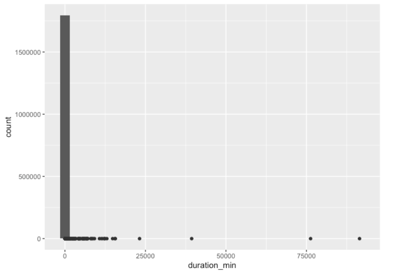
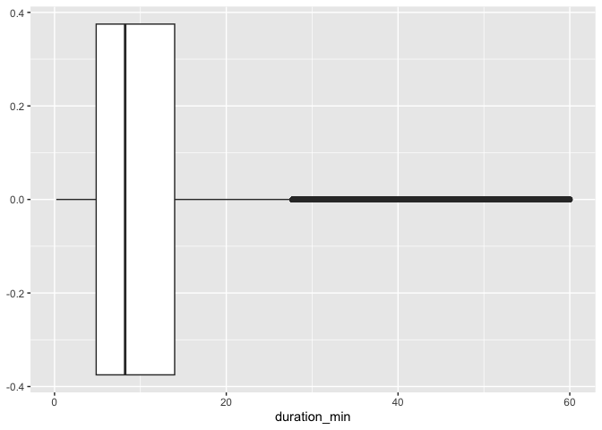
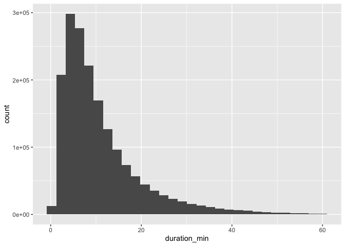
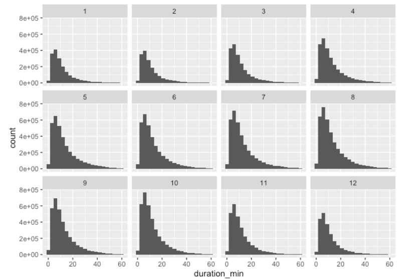
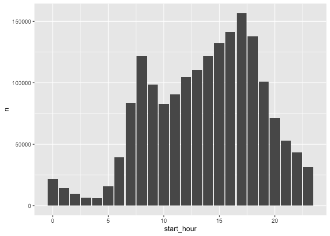
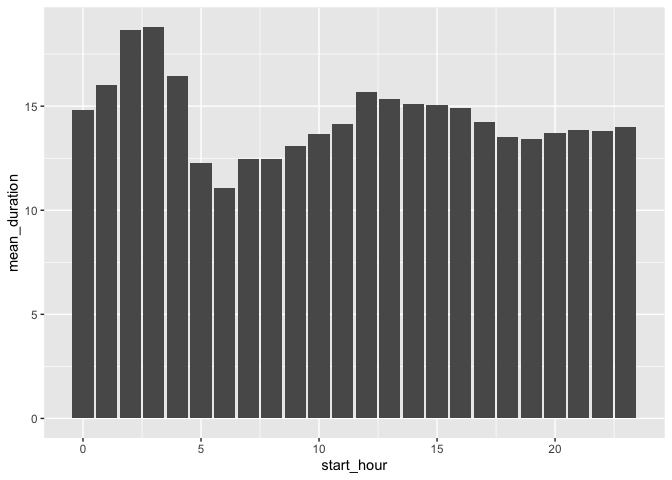
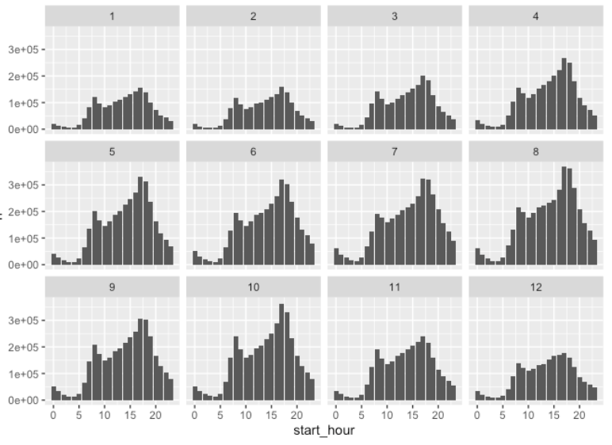
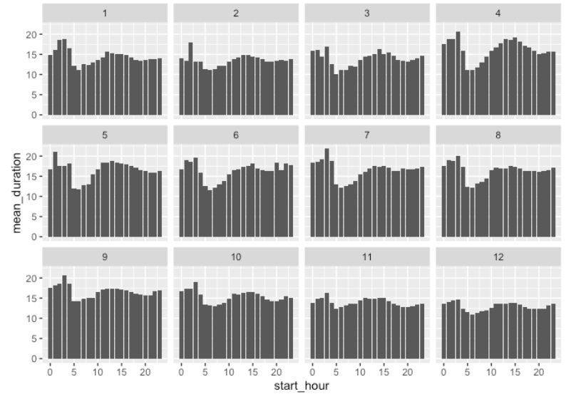

<script>
document.addEventListener("DOMContentLoaded", function() {

  // Wait until tocify has built the TOC
  let checkTOC = setInterval(function() {

    // Ensures headers exist
    if (document.querySelectorAll(".tocify-header").length > 0) {
      clearInterval(checkTOC);

      // Step 1: hide all H2 sections
      document.querySelectorAll(".tocify-subheader").forEach(function(ul){
        ul.style.display = "none";
      });

      // Step 2: Add click behavior to all H1 list items
      document.querySelectorAll(".tocify-item").forEach(function(header) {
        
        // clickable
        header.style.cursor = "pointer";

        header.addEventListener("click", function() {
          // find the ul.tocify-subheader immediately following this header
          let sub = header.nextElementSibling;

          if (sub && sub.classList.contains("tocify-subheader")) {
            // toggle show/hide
            if (sub.style.display === "none") {
              sub.style.display = "block";
            } else {
              sub.style.display = "none";
            }
          }
        });
      });

    }
  }, 200);
});
</script>


<div class="subpage-body">


# Temporal Patterns Overview
<div class="section-divider"></div>

This section explores **how CitiBike usage varies over time** in 2023, including  
monthly trends, distribution of trip durations, and within-day ridership patterns.  

---


# Data Import and Assembly
<div class="section-divider"></div>

The original temporal analysis loads all 2023 monthly files, extracts four variables  
(`ride_id`, `rideable_type`, `started_at`, `ended_at`), and stacks them into one unified dataset.

```{r, eval=FALSE}
library(tidyverse)
library(lubridate)
library(readr)

df_all = tibble()
folders = list.dirs("2023-citibike-tripdata", recursive = FALSE)

for (folder in folders) {
  files = list.files(folder, pattern = "\\.csv$", full.names = TRUE)
  for (file in files) {
    df_temp = read_csv(file) |>
      select(ride_id, rideable_type, started_at, ended_at)
    df_all <- bind_rows(df_all, df_temp)
    rm(df_temp)
    gc()
  }
}
```


# Feature Engineering
<div class="section-divider"></div>

Temporal variables were created to support month-level and hour-level analyses.  
Trip duration was computed in both minutes and hours.

```{r, eval=FALSE}
df_all = df_all |>
  mutate(
    start_month = month(started_at),
    start_day   = day(started_at),
    start_hour  = hour(started_at),
    start_min   = minute(started_at),
    end_month   = month(ended_at),
    end_day     = day(ended_at),
    end_hour    = hour(ended_at),
    end_min     = minute(ended_at),
    duration_min  = as.numeric(difftime(ended_at, started_at, units = "mins")),
    duration_hour = as.numeric(difftime(ended_at, started_at, units = "hours"))
  )
```


# Monthly Ride Trends
<div class="section-divider"></div>

The following summary table reports average duration, median duration,  
and total number of rides for each month.

```{r, eval=FALSE}
monthly_avg = df_all |>
  group_by(start_month) |>
  summarise(
    mean_duration = mean(duration_min, na.rm = TRUE),
    median_duration = median(duration_min, na.rm = TRUE),
    count = n()
  ) |>
  knitr::kable()

monthly_avg
```

---

## January Duration Distribution
To explore duration patterns, January is examined first.

```{r, eval=FALSE}
month1_his = ggplot(filter(df_all, start_month == 1), 
                    aes(x = duration_min)) +
  geom_histogram() +
  geom_boxplot()
month1_his
```

<div class="figure-container">
  
</div>

To limit extremely long rides, the analysis caps durations at **60 minutes**.

```{r, eval=FALSE}
month1_box_1 = ggplot(filter(df_all, start_month == 1 & duration_min < 60),
                      aes(x = duration_min)) +
  geom_boxplot()
month1_box_1
```

<div class="figure-container">
  
</div>

```{r, eval=FALSE}
month1_his_1 = ggplot(filter(df_all, start_month == 1 & duration_min < 60),
                      aes(x = duration_min)) +
  geom_histogram()
month1_his_1
```

<div class="figure-container">
  
</div>

A right-skewed distribution is observed consistently across all months.

---

## All-Months Duration Comparison

```{r, eval=FALSE}
month_his = ggplot(filter(df_all, duration_min < 60 & duration_min >= 0),
                   aes(x = duration_min)) +
  geom_histogram(binwidth = 3) +
  facet_wrap(~ start_month)

month_his
```

<div class="figure-container">
  
</div>

The shapes are similar across months, but overall ridership volume varies substantially.

---


# Hour-of-Day Patterns
<div class="section-divider"></div>

This section investigates which times of day see the most CitiBike usage.

---

## January Hourly Ridership

```{r, eval=FALSE}
day1_table = df_all |>
  filter(start_month == 1 & duration_min >= 0) |>
  group_by(start_hour) |>
  summarise(n = n(), mean_duration = mean(duration_min, na.rm = TRUE)) |>
  knitr::kable()

day1_table
```

```{r, eval=FALSE}
day1_col = df_all |>
  filter(start_month == 1 & duration_min >= 0) |>
  group_by(start_hour) |>
  summarise(n = n()) |>
  ggplot(aes(x = start_hour, y = n)) +
  geom_col()

day1_col
```

<div class="figure-container">
  
</div>

Rides occur mainly during daytime (7 AM–9 PM).

```{r, eval=FALSE}
day1_col_mean = df_all |>
  filter(start_month == 1 & duration_min >= 0) |>
  group_by(start_hour) |>
  summarise(mean_duration = mean(duration_min, na.rm = TRUE)) |>
  ggplot(aes(x = start_hour, y = mean_duration)) +
  geom_col()

day1_col_mean
```

<div class="figure-container">
  
</div>

Nighttime rides (12 AM–4 AM) tend to be **longer on average**.

---

## All-Months Hourly Ridership

```{r, eval=FALSE}
day_col = df_all |>
  filter(duration_min >= 0) |>
  group_by(start_month, start_hour) |>
  summarise(n = n()) |>
  ggplot(aes(x = start_hour, y = n)) +
  geom_col() +
  facet_wrap(~ start_month)

day_col
```

<div class="figure-container">
  
</div>

Summer months show clear peaks and heavier overall usage.

```{r, eval=FALSE}
day_col_mean = df_all |>
  filter(duration_min >= 0) |>
  group_by(start_month, start_hour) |>
  summarise(mean_duration = mean(duration_min, na.rm = TRUE)) |>
  ggplot(aes(x = start_hour, y = mean_duration)) +
  geom_col() +
  facet_wrap(~ start_month)

day_col_mean
```

<div class="figure-container">
  
</div>

December exhibits longer-than-average ride durations throughout the day.

</div>
