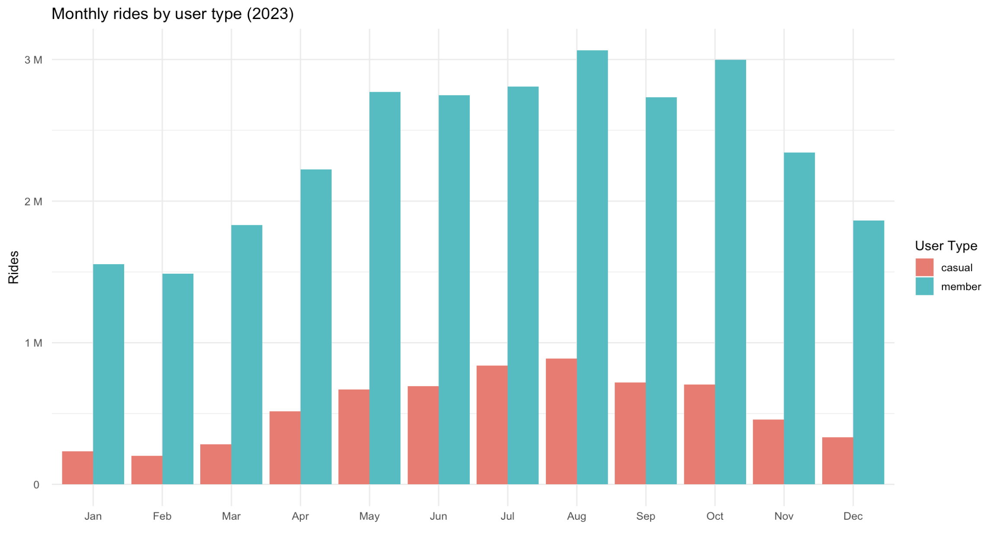
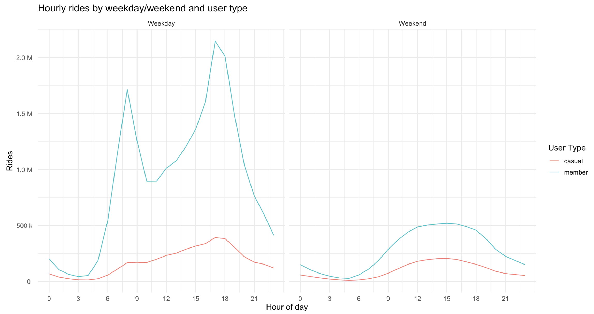
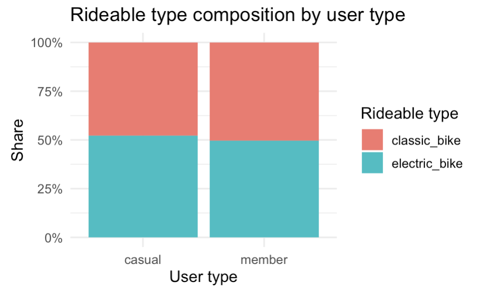
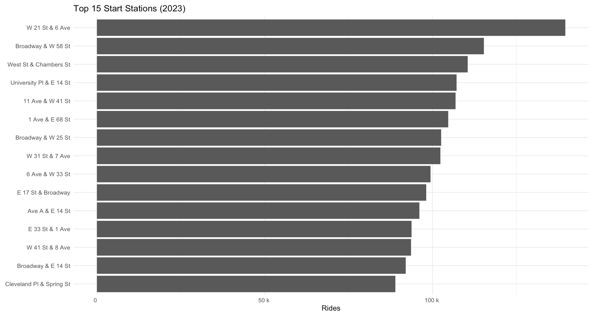
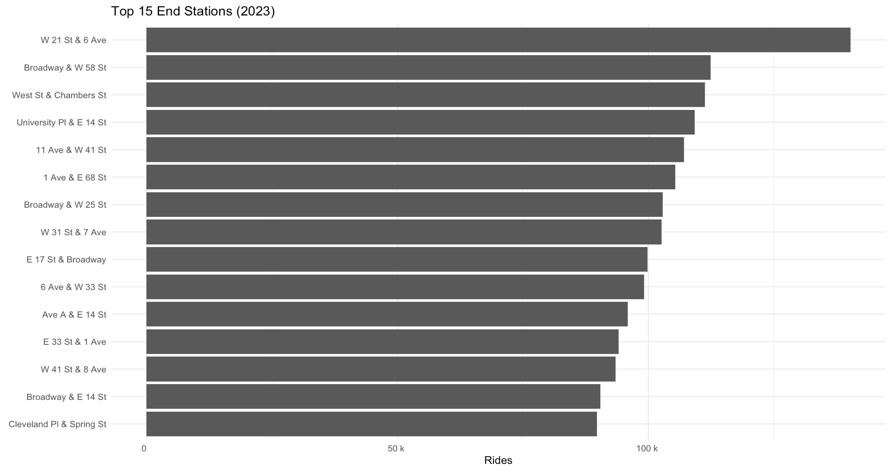
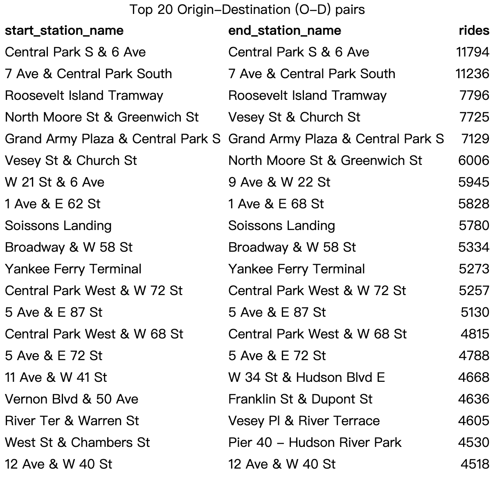

<script>
document.addEventListener("DOMContentLoaded", function() {

  // Wait until tocify has built the TOC
  let checkTOC = setInterval(function() {

    // Ensures headers exist
    if (document.querySelectorAll(".tocify-header").length > 0) {
      clearInterval(checkTOC);

      // Step 1: hide all H2 sections
      document.querySelectorAll(".tocify-subheader").forEach(function(ul){
        ul.style.display = "none";
      });

      // Step 2: Add click behavior to all H1 list items
      document.querySelectorAll(".tocify-item").forEach(function(header) {
        
        // clickable
        header.style.cursor = "pointer";

        header.addEventListener("click", function() {
          // find the ul.tocify-subheader immediately following this header
          let sub = header.nextElementSibling;

          if (sub && sub.classList.contains("tocify-subheader")) {
            // toggle show/hide
            if (sub.style.display === "none") {
              sub.style.display = "block";
            } else {
              sub.style.display = "none";
            }
          }
        });
      });

    }
  }, 200);
});
</script>


<div class="subpage-body">


# Users Patterns Overview
<div class="section-divider"></div>

This section analyzes **how different user types (member vs. casual)** behave when using CitiBike.  
We investigate data ingestion, cleaning, exploratory summaries, seasonal trends, hourly usage,
and station-level hotspots.  


---

# Data Import and Assembly
<div class="section-divider"></div>

## Load packages

```{r, eval=FALSE}
knitr::opts_chunk$set(
  echo = TRUE, message = FALSE, warning = FALSE, fig.width = 8, fig.height = 5
)

suppressPackageStartupMessages({
  library(tidyverse)
  library(lubridate)
  library(scales)
  library(glue)
  library(knitr)
  library(readr)
  library(purrr)
  library(dplyr)
})
```

Dataset source: https://citibikenyc.com/system-data  
Columns include:  
`ride_id`, `rideable_type`, `started_at`, `ended_at`, station names/IDs, coordinates, and membership status.


---

## Data Cleaning
<div class="section-divider"></div>

### Prepare output paths

```{r, eval=FALSE}
RAW_DIR <- params$raw_dir
OUT_DIR <- params$out_dir
OUT_FILE <- file.path(OUT_DIR, params$out_file)

dir.create(OUT_DIR, showWarnings = FALSE, recursive = TRUE)
```

### Column specification and reading

```{r, eval=FALSE}
col_spec <- cols(
  ride_id            = col_character(),
  rideable_type      = col_character(),
  started_at         = col_character(),
  ended_at           = col_character(),
  start_station_name = col_character(),
  start_station_id   = col_character(),
  end_station_name   = col_character(),
  end_station_id     = col_character(),
  start_lat          = col_double(),
  start_lng          = col_double(),
  end_lat            = col_double(),
  end_lng            = col_double(),
  member_casual      = col_character()
)

file_list <- list.files(RAW_DIR, pattern = "\\.csv$", full.names = TRUE)
stopifnot(length(file_list) > 0)

citibike_raw <- file_list %>%
  map(~ read_csv(.x, col_types = col_spec, progress = TRUE)) %>%
  bind_rows()
```

### Clean and keep 2023 only

```{r, eval=FALSE}
citibike_clean <- citibike_raw %>%
  mutate(
    started_at = ymd_hms(started_at, quiet = TRUE),
    ended_at   = ymd_hms(ended_at, quiet = TRUE),
    duration_min = as.numeric(difftime(ended_at, started_at, units = "mins")),
    duration_hr  = duration_min / 60,
    date      = as_date(started_at),
    month_lab = factor(month(started_at, label = TRUE, abbr = TRUE),
                       levels = month.abb, ordered = TRUE),
    wday_lab  = factor(wday(started_at, label = TRUE, abbr = TRUE),
                       levels = c("Sun","Mon","Tue","Wed","Thu","Fri","Sat"), ordered = TRUE),
    hour      = hour(started_at),
    member_casual = tolower(member_casual)
  ) %>%
  filter(
    duration_min >= 1,
    duration_min <= 360,
    !is.na(start_station_name),
    !is.na(end_station_name)
  ) %>%
  distinct(ride_id, .keep_all = TRUE)

# Save cleaned file
readr::write_csv(citibike_clean, OUT_FILE)
```


---

# Exploratory Data Analysis 
<div class="section-divider"></div>

## Monthly Rides by User Type

```{r, eval=FALSE}
rides_by_month_user <- citibike_clean %>%
  count(month_lab, member_casual, name = "rides") %>%
  mutate(month_lab = factor(month_lab, levels = month.abb, ordered = TRUE))

ggplot(rides_by_month_user,
       aes(x = month_lab, y = rides, fill = member_casual)) +
  geom_col(position = "dodge") +
  scale_y_continuous(labels = label_number(scale_cut = cut_si(" "))) +
  labs(
    title = "Monthly rides by user type (2023)",
    x = NULL, y = "Rides", fill = "User Type"
  ) +
  theme_minimal(base_size = 12)
```

<div class="figure-container">
  
</div>

Seasonal variation is strong:  
- Usage rises sharply from spring to summer (Apr–Sep), peaking in July/August.  
- Member rides dominate year-round, reflecting commuter behavior.  
- Casual riders show strong seasonality tied to weather and tourism.


---

## Weekday vs Weekend & Hourly Pattern

```{r, eval=FALSE}
rides_by_wday_hour <- citibike_clean %>%
  mutate(is_weekend = wday_lab %in% c("Sat","Sun")) %>%
  mutate(is_weekend = factor(is_weekend, levels = c(FALSE, TRUE), labels = c("Weekday","Weekend"))) %>%
  count(is_weekend, hour, member_casual, name = "rides")

ggplot(rides_by_wday_hour,
       aes(x = hour, y = rides, color = member_casual, group = member_casual)) +
  geom_line() +
  facet_wrap(~ is_weekend) +
  scale_y_continuous(labels = label_number(scale_cut = cut_si(" "))) +
  scale_x_continuous(breaks = seq(0, 23, 3)) +
  labs(
    title = "Hourly rides by weekday/weekend and user type",
    x = "Hour of day", y = "Rides", color = "User Type"
  ) +
  theme_minimal(base_size = 12)
```

<div class="figure-container">
  
</div>

- Weekdays show strong **commuter peaks** at 8 AM & 6 PM.  
- Weekends show smoother all-day activity, with casual riders dominating afternoon hours.  
- Night rides (12–4 AM) tend to have longer durations.


---

## Rideable Type Mix

```{r, eval=FALSE}
rideable_mix <- citibike_clean %>%
  count(rideable_type, member_casual, name = "rides") %>%
  group_by(member_casual) %>%
  mutate(pct = rides / sum(rides)) %>%
  ungroup()

ggplot(rideable_mix, aes(x = member_casual, y = pct, fill = rideable_type)) +
  geom_col(position = "fill") +
  scale_y_continuous(labels = percent_format()) +
  labs(
    title = "Rideable type composition by user type",
    x = "User type", y = "Share", fill = "Rideable type"
  ) +
  theme_minimal(base_size = 12)
```

<div class="figure-container">
  
</div>

Bike-type preference is nearly identical across user groups.  
Both members and casual riders use electric and classic bikes in similar proportions.


---

# Station Hotspots
<div class="section-divider"></div>

## Top 15 Start & End Stations

```{r, eval=FALSE}
top_start <- citibike_clean %>%
  count(start_station_name, sort = TRUE, name = "rides") %>%
  slice_head(n = 15)

top_end <- citibike_clean %>%
  count(end_station_name, sort = TRUE, name = "rides") %>%
  slice_head(n = 15)

kable(top_start, caption = "Top 15 start stations (by rides)")
kable(top_end, caption = "Top 15 end stations (by rides)")
```

### Bar Charts

```{r, eval=FALSE}
ggplot(top_start, aes(x = reorder(start_station_name, rides), y = rides)) +
  geom_col() +
  coord_flip() +
  scale_y_continuous(labels = label_number(scale_cut = cut_si(" "))) +
  labs(title = "Top 15 Start Stations (2023)", x = NULL, y = "Rides") +
  theme_minimal(base_size = 11)
```

<div class="figure-container">
  
</div>

```{r, eval=FALSE}
ggplot(top_end, aes(x = reorder(end_station_name, rides), y = rides)) +
  geom_col() +
  coord_flip() +
  scale_y_continuous(labels = label_number(scale_cut = cut_si(" "))) +
  labs(title = "Top 15 End Stations (2023)", x = NULL, y = "Rides") +
  theme_minimal(base_size = 11)
```

<div class="figure-container">
  
</div>

---

## Most Common O–D Pairs

```{r, eval=FALSE}
top_od <- citibike_clean %>%
  count(start_station_name, end_station_name, sort = TRUE, name = "rides") %>%
  filter(!is.na(start_station_name), !is.na(end_station_name)) %>%
  slice_head(n = 20)

kable(top_od, caption = "Top 20 Origin-Destination (O-D) pairs")
```

<div class="figure-container">
  
</div>

- High-volume O–D trips cluster around **Central Park**, **Hudson River Park**, and **Midtown**.  
- Many are **loops**, indicating sightseeing and recreational riding.  
- Others reflect short-distance commuting in Financial District and Hudson Yards.  
- Understanding these patterns guides station rebalancing and capacity planning.

</div>
