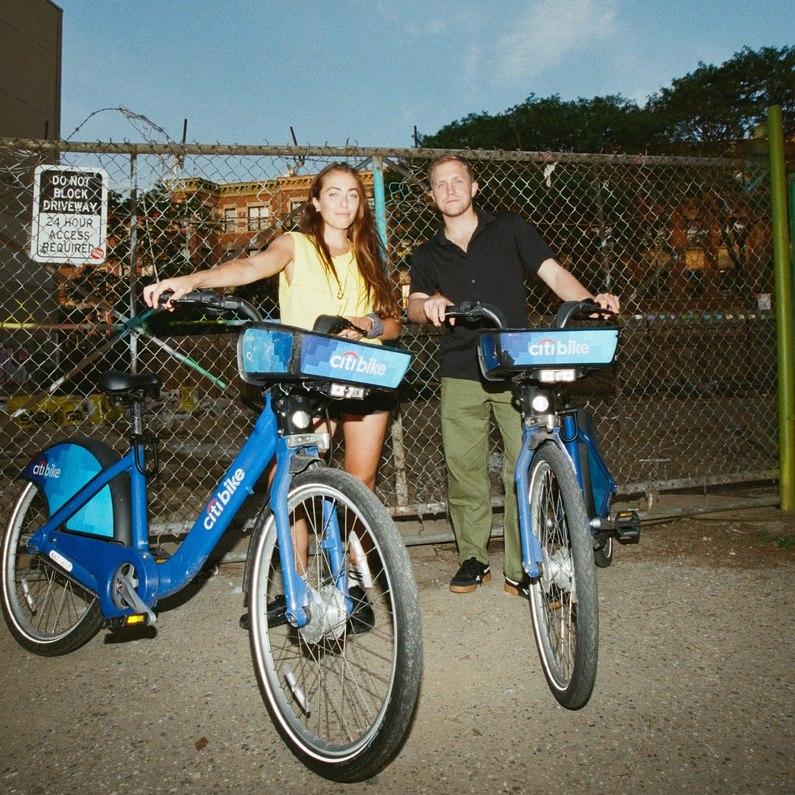
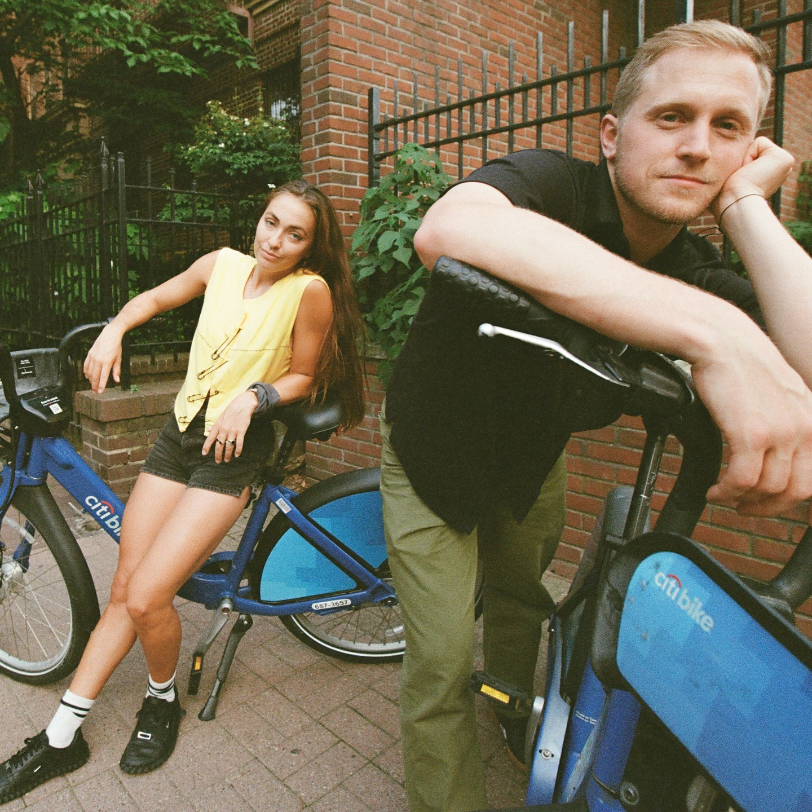
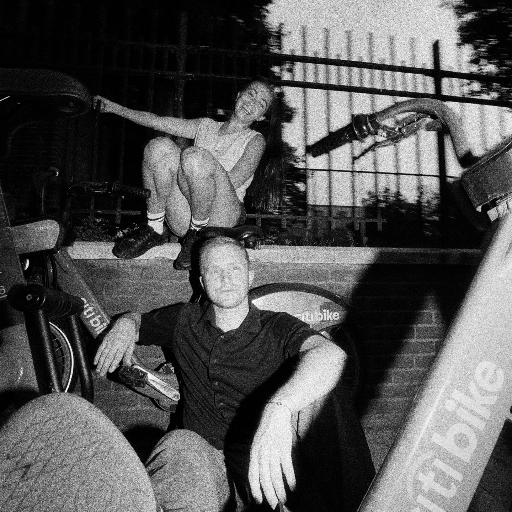
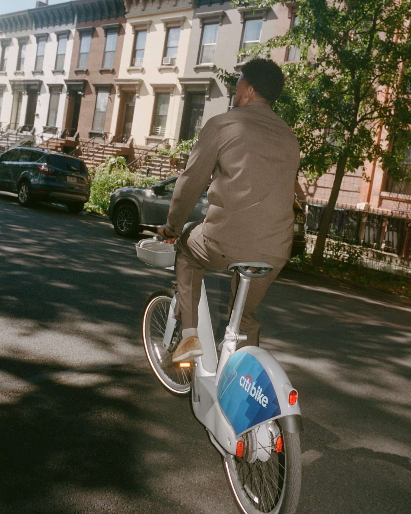

<style>
h1.title {
  display: none;
}
</style>


```{r setup, include=FALSE}
knitr::opts_chunk$set(echo = FALSE, message = FALSE, warning = FALSE)
library(htmltools)
```

```{r hero, results='asis'}
HTML('
<div class="hero-wrapper">
  <div class="hero-container">
    
    <div class="hero-text-side">
      <div class="tracking-label">MULTIMODAL TRACKING ACTIVE</div>
      <h1 class="hero-title">EXPLORING CITIBIKE USAGE IN NYC</h1>
      <p class="hero-subtitle">USE 2023 FULL YEAR DATA</p>
    
      <div class="hero-buttons">
        <a class="btn btn-primary" href="analysis_temporal.html">VIEW ANALYSIS</a>
        <a class="btn btn-primary" href="report.html">FULL REPORT</a>
      </div>
    </div>
    
    
    <div class="hero-image-side">
  <div class="photo-frame slideshow">

    
    
    
    

    <div class="corner-bl"></div>
    <div class="corner-tr"></div>
  </div>
</div>

    
  </div>
</div>

<div class="section-divider"></div>
')
```

<div class="container-fluid">

## MISSION OBJECTIVES
```{r cards, results='asis'}
HTML('
<div class="cards-grid-4">

  <div class="card hud-frame">
    <div class="card-icon">📍</div>
    <h3>SPATIAL PATTERNS</h3>
    <p>Manhattan dominates with 70%+ rides. Top stations: Central Park, Midtown, Hudson River.</p>
  </div>

  <div class="card hud-frame">
    <div class="card-icon">⏰</div>
    <h3>TEMPORAL DYNAMICS</h3>
    <p>Summer peak in July-August. Weekday commute spikes at 8 AM and 6 PM.</p>
  </div>

  <div class="card hud-frame">
    <div class="card-icon">👥</div>
    <h3>USER BEHAVIOR</h3>
    <p>Members are commuters. Casual users are weekend leisure riders.</p>
  </div>

  <div class="card hud-frame">
    <div class="card-icon">🚴</div>
    <h3>RIDE PATTERNS</h3>
    <p>Loop trips dominate Central Park. Average duration is 12-17 minutes.</p>
  </div>

</div>
')
```
```{r divider1, results='asis'}
HTML('<div class="section-divider"></div>')
```

## INTERACTIVE STATION MAPS

### START STATIONS - ORIGIN TRACKING
```{r map_start, results='asis'}
HTML('
<div class="hud-frame map-container">
  <iframe src="map_start.html" width="100%" height="600px" frameborder="0"></iframe>
</div>
')
```

<br>

### END STATIONS - DESTINATION TRACKING
```{r map_end, results='asis'}
HTML('
<div class="hud-frame map-container">
  <iframe src="map_end.html" width="100%" height="600px" frameborder="0"></iframe>
</div>
')
```
```{r map_info, results='asis'}
HTML('
<div class="info-alert hud-frame" style="margin-top: 20px;">
  <p><strong>💡 MAP INSIGHTS:</strong></p>
  <ul style="text-align:left; margin-left:20px;">
    <li>Hover markers for station names and ride counts</li>
    <li>Zoom to explore neighborhood patterns</li>
    <li>Notice the Manhattan concentration</li>
  </ul>
</div>
')
```
```{r divider2, results='asis'}
HTML('<div class="section-divider"></div>')
```

## EXPLORE DEEPER
```{r explore_cards, results='asis'}
HTML('
<div class="explore-grid-3">

  <a href="analysis_spatial.html" class="explore-card hud-frame">
    <i class="fa fa-map-marker fa-2x"></i>
    <h3>SPATIAL ANALYSIS</h3>
    <p>Station hotspots and geographic distribution</p>
  </a>
  
  <a href="analysis_temporal.html" class="explore-card hud-frame">
    <i class="fa fa-clock-o fa-2x"></i>
    <h3>TEMPORAL PATTERNS</h3>
    <p>Hourly, daily and seasonal trends</p>
  </a>
  
  <a href="data.html" class="explore-card hud-frame">
    <i class="fa fa-database fa-2x"></i>
    <h3>DATA PROCESSING</h3>
    <p>Cleaning and transformation pipeline</p>
  </a>

</div>
')
```
```{r divider3, results='asis'}
HTML('<div class="section-divider"></div>')
```

## PROJECT SCREENCAST
```{r video, results='asis'}
HTML('
<div class="video-container hud-frame">
  <iframe width="100%" height="500" src="https://www.youtube.com/embed/4YGVzvdbU1g?si=dA-oPJSPSaoe8u1s" title="YouTube video player" frameborder="0" allow="accelerometer; autoplay; clipboard-write; encrypted-media; gyroscope; picture-in-picture; web-share" referrerpolicy="strict-origin-when-cross-origin" allowfullscreen></iframe>
  <p style="text-align:center; margin-top:10px; color:#666;"></p>
</div>
')
```

</div>

<br><br>
```{r footer, results='asis'}
HTML('
<div class="footer" style="text-align:center; padding:30px; border-top:2px solid #265BFF; margin-top:60px;">
  <p style="font-size:14px; color:#666;">P8105 DATA SCIENCE FINAL PROJECT @ 2025</p>
  <p>
    <a href="https://github.com/ZizhiXia/p8105_2025final" style="color:#265BFF;">
      <i class="fa fa-github"></i> GITHUB
    </a>
  </p>
</div>
')
```

<script>
let slides = document.querySelectorAll('.slideshow .slide');
let index = 0;

setInterval(() => {
  slides[index].classList.remove('active');
  index = (index + 1) % slides.length;
  slides[index].classList.add('active');
}, 2500);  
</script>
